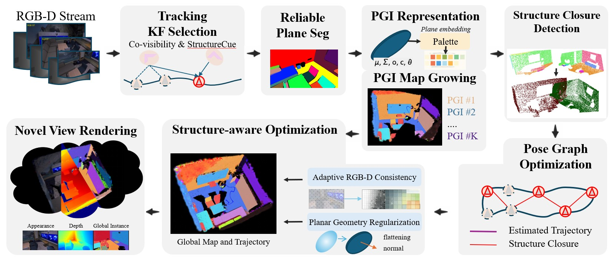

<h1 align="center">
Structure Gaussian Splatting SLAM
</h1>

## Overview

StructureGS-SLAM is a structure-aware Gaussian Splatting SLAM framework that models persistent planar structures as **Planar Gaussian Instances (PGIs)**. The proposed system introduces:

- Persistent Planar Gaussian Instance (PGI) representation
- Structure Closure for drift correction without loop revisits
- Structure-aware Gaussian optimization
- Adaptive RGB-Depth consistency for low-texture environments

## Paper

The paper will be released soon. 

## Code

The source code will be released soon.

## Results

Our method achieves state-of-the-art performance on Replica and TUM RGB-D benchmarks in:

- Camera pose estimation
- Novel view synthesis
- Dense reconstruction
- Low-texture robustness

## License

This project is released under the MIT License.
